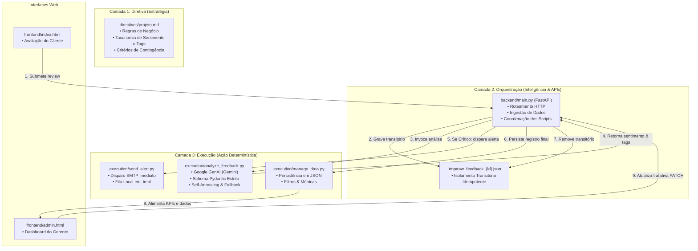

# 🏛️ Arquitetura do Sistema: Analisador de Feedbacks Hamburgueria Gourmet

Este documento descreve a topologia técnica e o fluxo de dados do sistema, estruturado com base no **Framework de 3 Camadas** do **Google Antigravity**.

---

## 📐 Visão Geral da Arquitetura de 3 Camadas

---

## 🔄 Fluxo de Processamento de Feedback (Ciclo de Vida)

1. **Ingestão:** O cliente acessa a página pública (`/`), preenche o formulário e envia uma requisição `POST /api/feedbacks`.
2. **Isolamento Transitório:** A requisição é imediatamente gravada em `.tmp/raw_feedback_{id}.json`, garantindo persistência temporária antes do processamento.
3. **Análise Semântica (IA):** O script `execution/analyze_feedback.py` consome a API do Google Gemini com schema rigoroso:
   - **Sentimento:** `Positivo`, `Neutro` ou `Crítico`.
   - **Tags:** `Entrega`, `Sabor` e/ou `Atendimento`.
   - **Resiliência (Self-Annealing):** Retentativa com múltiplos modelos suportados (`gemini-3.8-flash`, `gemini-3.6-flash`, etc.), sanitização de JSON, temperatura 0 e fallback determinístico local.
4. **Triagem de Urgência:** Se a classificação for `Crítico`, aciona `execution/send_alert.py`:
   - Disparo de e-mail via servidor SMTP com template HTML executivo para o gerente.
   - Em caso de falha de conexão ou ausência de credenciais, o alerta é preservado com segurança na fila de contingência `.tmp/failed_alerts_queue.json`.
5. **Persistência Estruturada:** O registro consolidado é salvo no banco de dados JSON (`backend/data/feedbacks.json`) e o arquivo transitório é removido.
6. **Moderação Administrativa:** O gestor acessa o Painel (`/admin`), onde visualiza métricas em tempo real, filtra por sentimento/tag e marca as ocorrências como tratadas.

---

## 🛡️ Padrões de Tolerância a Falhas e Resiliência

| Componente | Possível Ponto de Falha | Mecanismo de Recuperação (Self-Annealing) |
|---|---|---|
| **Google GenAI** | Cota de API excedida / Erro 503 / 404 | Troca automática entre modelos da família Gemini, sanitização de JSON com temperatura zero e fallback determinístico. |
| **Servidor SMTP** | Timeout de rede ou credenciais pendentes | Enfileiramento na contingência `.tmp/failed_alerts_queue.json` sem interromper a experiência do usuário. |
| **Integridade de Dados** | Queda abrupta de energia durante requisição | Isolamento em arquivo `.tmp/` prévio à análise para garantir reprocessamento idempotente. |

---

*Documento gerado sob o padrão Google Antigravity - SENAI Edition.*
