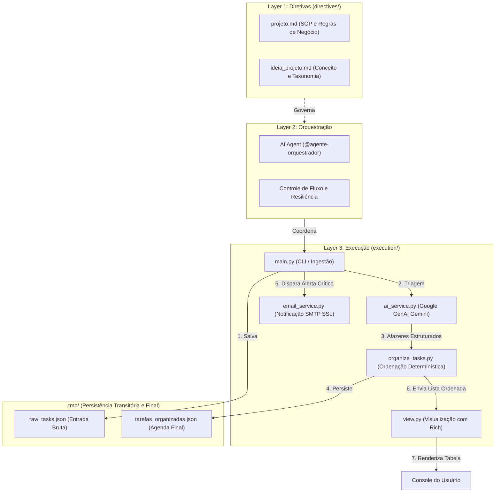

# 🏛️ Documentação de Arquitetura - Smart To-Do List

## 1. Visão Geral
Este documento descreve a arquitetura do projeto **Smart To-Do List**, implementado sob a governança da **Arquitetura de 3 Camadas** do Google Antigravity e AG Kit.

## 2. Camadas do Sistema

### 2.1 Camada 1: Diretivas (`directives/`)
- Procedimentos Operacionais Padrão (SOP) definindo a taxonomia:
  - **Crítica (Score 5):** Riscos graves, vazamentos, prazos com hora marcada iminente.
  - **Alta (Score 4):** Compromissos de trabalho e acadêmicos relevantes.
  - **Média (Score 3):** Demandas rotineiras e afazeres domésticos.
  - **Baixa (Score 1-2):** Tarefas triviais e opcionais.

### 2.2 Camada 2: Orquestração
- Gerencia o ciclo de vida da execução, tratamento defensivo de falhas de rede/quota com cascata de contingência de modelos Gemini (`gemini-3.1-flash-lite` -> `gemini-3.5-flash-lite` -> `gemini-3.6-flash`).

### 2.3 Camada 3: Execução (`execution/`)
- **`ai_service.py`**: Comunicação com o Google GenAI SDK utilizando schemas estritos do Pydantic (`Tarefa` e `TriagemTarefas`) com rotação de modelos para alta disponibilidade.
- **`organize_tasks.py`**: Algoritmo determinístico com chave `(-score_prioridade, tempo_estimado_minutos)` e persistência em `.tmp/tarefas_organizadas.json`.
- **`email_service.py`**: Automação de notificação e alertas por e-mail HTML via SMTP/SSL direcionado ao gestor para tarefas críticas.
- **`view.py`**: Interface rica no terminal com badges de prioridade, métricas e rodapé obrigatório.

---

Criado por <a href="https://siteprofissional.pro" style="color: blue;">siteprofissional.pro</a>

